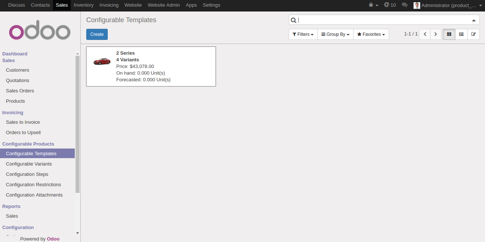
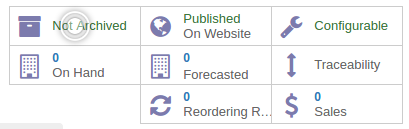
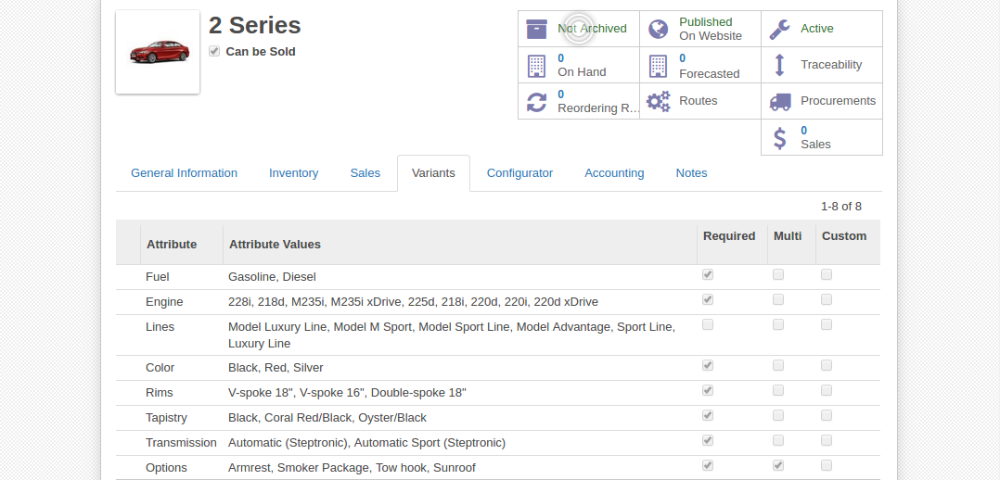

********************
Adding a new product
********************

The Product Configurator makes it easy for you to add configurable products in just a few steps. In the rows below we will explain the entire process of adding a product that can be configured.

Defining a configurable product
===============================

The first thing we need to do is navigate to **Sales** tab in the back-end and afterwards under the **Configurable Products** section we select **Configurable Templates** and click the **Create** button.

.. note::
    If you already have products in the database and wish to make them configurable just click on the form button with the wrench icon on the top right

After we have clicked on the **Create** button in the first section we are now given Odoo's standard product form view. When we are done with naming our product and setting all the relevant information we can move on to the **Variants** tab inside the form.

Adding attributes and values
============================

.. note::
    If you are already running the system as an Administrator you will have access to the Product Variants and Product Configurator from the start. In order for other users to gain access you must add them to the Product Configurator group which will activate Product Variants as well.

    To do this you must first activate Odoo's *Developer mode* as an Administrator. This is done by cliking in the right upper corner in the backend where the Administrator panel is located. Select **About** from the dropdown panel a pop-up window will appear. On the new opened pop-up window click the **Activate the developer mode**.

    After the *Developer mode* is activated you must now navigate to the **Settings** tab and from the **Users** menu on the left click **Users**. Select your desired user and assign him the Product Configurator group.

Every configurable product starts with the population of the *Attributes* table. The attributes inside the *Variants* tab are used to add all the possible options of the product. When a regular product has attributes set it will automatically generate all possible combinations on saving. However this is often a unwanted behavior and is inhibited by configurable products.

We recomand adding data to the *Attributes* table by planing and analysing your product first. Include all possible options from the start, for example if colors, sizes and shapes the attribute table can be populated like this:

===============  =============================
 **Attributes**   **Attibute Values**
---------------  -----------------------------
  Color           Red, Blue, Green
  Size            Small, Medium, Large
  Shape           Square, Circle
===============  =============================

The **Requierd** field makes sure that the configuration process of the product cannot finish until it a value has been provided for the specific attribute. Also depending on the configuration interface it might also enforce client-side validation. This prevents users from proceeding to the next step until setting a value for the attribute in question.

The **Multi** field marks the ability to store more than one value for the attribute. In our demo instance it is used for the car's Optionals (Sunroof, Tow Hook etc)

The **Custom** field determines if the attribute allows values other than the ones provided. These are entered by the user in the configuration interface and can be also restricted to certain field types and even values. More on Custom values here (link)

