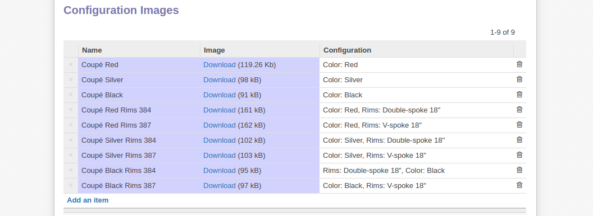

********************
Configuration images
********************

Any product that is built from the ground up goes through changes in appearence. Having this in mind, the Product Configurator offers a easy way to help the user visualize his product from start to finish.

Looking at the **Configuration Images** we notice 3 columns

1. **Name** column defines the name of our image.

2. **Image** column is where we upload our image.

3. **Configuration** column holds the configuration code that will trigger the display of the related image. This means that in our case when the user selects Color: Red, he gets the first line, when he selects Color: Red, and Rims: Double-spoke 18" he gets the fourth image.

.. note::
    The algorithm applied tries to match the closest configuration. First it gets the line that matches all the values specified with the configuration of the user. If two or more are found it is sorted by sequence.

|

In our example this is necesary for creating diffrent appearances of the car when the user wants to select a diffrent pair of rims or another color. What the Product configurator does here is that it will switch betwen images in the interface. We use two separate images of the same car but in the second picture the rims are diffrent thus creating a shifting effect.

.. note::
    While this mechanism is fine for simple builds it is highly impractical for complex products with many images. An update is already in the roadmap to provide placement of static images on the canvas with different z-index instead of providing separate images. Also 3D models and animations are planned as well