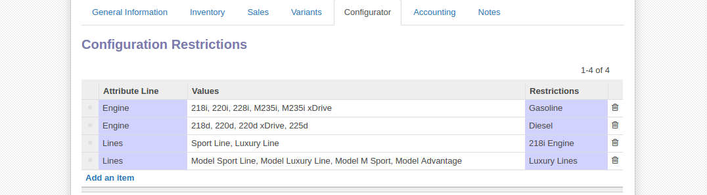

**************************
Configuration restrictions
**************************

Often times a product does not support all possible combinations and values must be restricted depending on the selection of others. The main purpose of the **Configuration Restrictions** table is to facilitate an error free final configuration. We have previosuly set all the possible options on the product in the attributes section, now we must add configuration restrictions to prevent incompatible builds.

We will illustrate the concept and process by using our car demo product. Our objective is to create a rule for the *Engine* so when a user selects the fuel type as *Gasoline* or *Diesel* all incompatible engine models are eliminated from the options list.

Switching to the Configurator tab under the *Configuration Restrictions* a new line is added. In this table you are given three colums: **Attribute line**, **Values** and **Restrictions**. First we pick our restricted attribute in this case Engine, and then the values we wish to restrict from that attribute. Our first line contains all the Gasoline engine types. Lastly in the Restrictions box we make a new entry using the *Create and Edit* option to determine under what conditions will the selected values be available.

At this point in time the following setup can be translated into something such as: "Values '218i, 220i, 228i, M235i, M235i xDrive' of the attribute 'Engine' are only available if ".

We then complete that statement by defining the rules of the restriction. First we add a name to give a readable reference of the rule the restrictions imply (Gasoline). Below the name field we are presented with 5 columns:

1. **Attribute**: The attribute the rule depends on
2. **Condition**: The condition that determines if the attribute should be "In" or "Not In" the values provided in the next column
3. **Values**: Values of the attribute that should be checked
4. **Operator**: "And / Or" operator for chaining with the next rule

By adding "Fuel", "In", "Gasoline" we have made the full statement of "Values '218i, 220i, 228i, M235i, M235i xDrive' of the attribute 'Engine' are only available if Fuel has values in Gasoline".

If the user selects the Engine type as Gasoline he will be prompted only the engines that work on that fuel type and not both. The same logic is applied in the next line to diesel engines. This enforces client-side validation as well as server-side meaning that a configuration that breaks these rules can not be saved into the database.

Line three for example has the following restriction: If the engine type *218i* is selected you can not pick it in combination with the optional packages *Sport line* and *Luxury line*.

This is a concept widely used everywhere in Odoo, including the search function called Domain Restrictions (https://www.odoo.com/documentation/9.0/reference/orm.html#reference-orm-domains)