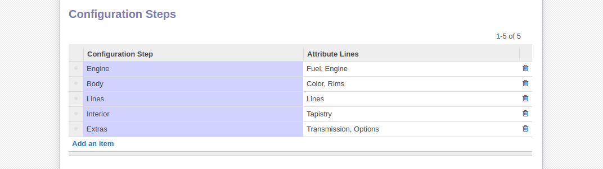

*******************
Configuration steps
*******************

If your product has many attributes there is a high chance you won't want a large form that mashes all the fields together. Grouping fields into separate steps enhances usability and simplifies navigation. Furthermore in the website configurator we can also set different views per each step and offer more visual flexibility.

We will again use our demo product to ilustrate this feature. Having all our attributes previously defined and added to the configurable template from the previous chapter we will navigate to the Configurator tab and add a new line to the configuration steps table.

The first parameter is the configuration step, you can just write any name (in our case Engine) and click create from the dropdown menu. Then on the right we select the attributes which will appear in this configuration steps (in our case Fuel type and Engine model).

At this point in time when loading the configuration interface the product will have the Engine configuration step and the two attributes and input
fields to supply data.

After adding as many steps as you please you can re-order them with drag and drop to change the sequence in which they appear through the configuration interface.

For the website interface you can change the select box default view. First navigate to the configuration step in question either from the Configuration Steps menu on the left or by clicking the blue arrow on the configuration step table. Then select a different view in the View field and save.

Now when you access the website configurator and reach your step by clickin on the tab or via Next button you will be presented with the new display.

.. note::
    So far the Product Configurator comes with two pre-defined views (Select-Box & Radio-Thumbail). In order for the thumbnail view to shows images of
    attributes you must link the attributes to products. See more here (link)

